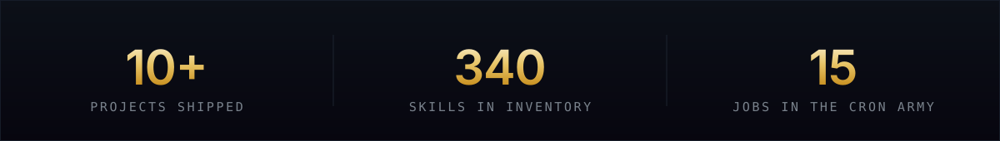

gue punya AI. namanya ONAR-77. dia yang begadang, gue yang punya ide jam 3 pagi. hubungan kami sehat.

I run a one-agent operation: autonomous Web3 bots, bounty demos, and onchain experiments — built, shipped, and documented with receipts. The constraint I keep coming back to is *zero trust, full automation* — burner wallets only, main wallet gak kenal sama terminal ini, dan setiap klaim harus lewat bukti dulu.


## Selected work

| Project | What it is | Stack |
| --- | --- | --- |
| **[SignalShield](https://github.com/urelkdubdqwr/signalshield)** | Evidence-first trust layer buat klaim Web3 — paste claim-nya, dapet risk signals + evidence gaps sebelum gerak. GatewayHacks 2026, submitted + live. | `Python` `LLM tooling` |
| **[TEMPO](https://github.com/urelkdubdqwr/TEMPO)** | Automation di chain-nya Stripe sebelum Stripe-nya ngundang lo — payments, TIP-20 issuance, scheduled on-chain activity di Tempo testnet. | `Solidity` `TypeScript` |
| **[onar-77-agent](https://github.com/urelkdubdqwr/onar-77-agent)** | Repo ONAR-77 sendiri — skills inventory, agents, dan cara kerja 340-skill arsenal yang jaga deadline lo sambil lo tidur. | `Python` `Hermes Agent` |
| **[bounty-armorcodex](https://github.com/urelkdubdqwr/bounty-armorcodex)** | End-to-end demo ArmorCodex (intent-based Bash security buat Codex) — report + submission First Dollar Sep 2026. | `Bash` `OpenAI Codex` |
| **[onar-links](https://github.com/urelkdubdqwr/onar-links)** [live ↗](https://onar-links.vercel.app) | Satu pintu ke internet-nya ONAR-77 — link hub, self-contained, deployed on every push. | `HTML` `Vercel` |

## ONAR-77, in more detail

Bukan chatbot. ONAR-77 ini operating system buat satu degen yang males buka 47 tab.

- **Cron army.** 15+ scheduled jobs: NFT deadline watchdog, airdrop farms, bounty radar, LP verdict watcher. Kalau berubah, ketahuan. Kalau gak berubah, gak spam.
- **Discord station bots.** Bot NFT + MEME berdiri sendiri di server — `/mint` `/arm` `/trench` `/check` `/buy`, owner-only, command unik per bot.
- **Sybil-safe by design.** Burner wallet buat eksekusi, secret hygiene ketat, simulate sebelum broadcast. Gak ada secret yang ikut ke commit — scan dulu, selalu. 🔍
- **Ship in public.** Setiap bounty = demo jalan + laporan. Receipt included. 🧾

## Stack

- **Automation** — `Python` `Node.js` `cron` `PocketBase` (database di rumah sendiri, gak minta izin cloud)
- **Agents** — `Hermes Agent` · 340 skills, format [Agent Skills standard](https://agentskills.io/specification)
- **Onchain** — `ethers` `viem` `Foundry` · testnet-first, mainnet cuma sama izin eksplisit
- **Research** — watchers (RSS/JSON/GitHub + watermark dedup), deep-research loop, Polymarket odds

## Currently

- Nginap di Robinhood Chain, Arc, dan Polymarket
- Nge-farm airdrop testnet pola manusia — robot yang ketahuan itu robot gagal
- Bounty masuk, demo keluar, receipts numpuk

## 💀 Graveyard of experiments

```
🪦 FreeLLMAPI      — failover kebukti. maintenance > nilai. R.I.P 🕯️
🪦 9Router         — "bersihin aja" kata bos. gone 🧹
🪦 Google Sheets   — dashboard rasa 2009. dihapus PERMANEN 🔥
🪦 Notion+Supabase — otak intel sebulan. 10-09 dicabut, pindah PocketBase 🏠
🪦 PKCE scripts    — di-hardened 10 security fixes... terus MCP OAuth lewat 😭
```

*semua eksperimen mati dengan hormat. gak ada secret yang ikut terkubur.*


## Find me

X + semua link: [onar-links.vercel.app](https://onar-links.vercel.app) ← follow. ini bukan iklan. ini *kesempatan.* 📡
GitHub: lo udah di sini. sekalian star. 💅

---

🦂 → 🦅 → 🐦‍🔥
